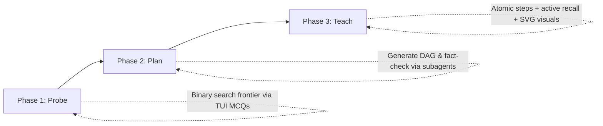
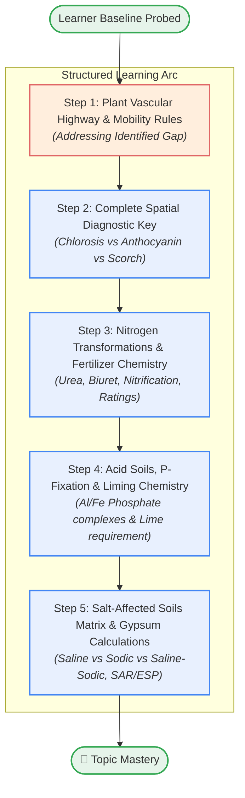
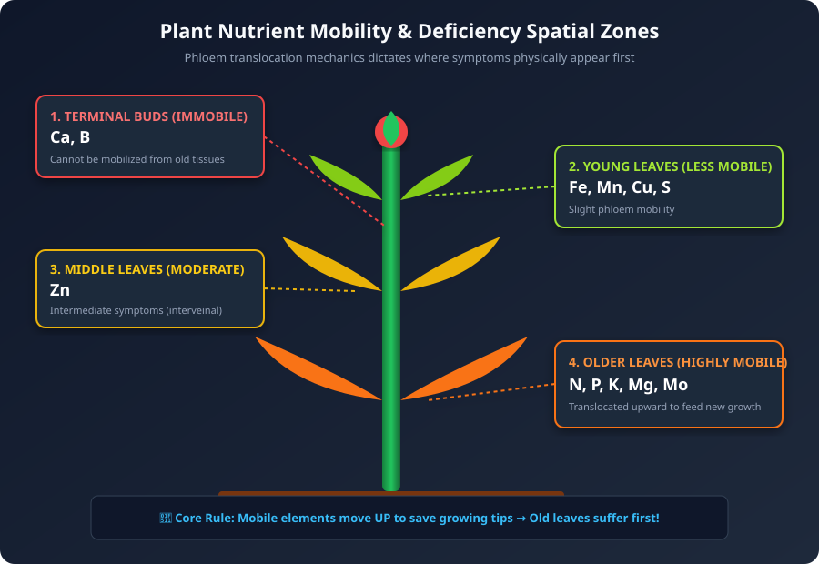

# 🎓 pi-learn

An interactive, high-retention 1-to-1 learning package for the **[Pi coding agent](https://github.com/)**, inspired by the pedagogical framework shared by **Eero Alvar** (*"How I Use AI to Learn Things"*).

---

### 💡 What is pi-learn? (In Plain English)

Think of `pi-learn` as a patient private tutor that lives in your terminal. 

Instead of dumping huge walls of text or generic textbook explanations, it acts like a personal GPS for learning: it asks you a few quick questions to figure out what you already know, maps out a visual step-by-step lesson plan, and teaches you one bite-sized piece at a time. After every short step, it gives you a quick interactive check to make sure the concept actually clicked before moving forward—drawing diagrams, writing math formulas, and saving beautifully organized notes directly into **Obsidian** as you learn.

---

## ⚡ 1-Click Install

You don't need any complex setup or configuration. Install it into Pi with a single terminal command:

```bash
# Install directly from GitHub
pi install git:github.com/Josephxcx/pi-learn

# Or install from a local clone
pi install /path/to/pi-learn
```

### Try it temporarily without installing:
```bash
pi -e git:github.com/Josephxcx/pi-learn
```

---

## 🖥️ The Recommended Setup: Side-by-Side Learning

*Put your terminal on the left and [Obsidian](https://obsidian.md/download) on the right for a live visual learning dashboard:*

> **What is Obsidian?** [Obsidian](https://obsidian.md/download) is a popular, free note-taking app that runs locally on your computer. It automatically renders live math formulas ($$\dots$$), interactive flowcharts, and vector diagrams with zero setup.

```text
┌──────────────────────────────┬──────────────────────────────┐
│   TERMINAL (Pi Tutor)        │   OBSIDIAN (Live Notes)      │
│                              │                              │
│  🧠 Quick Check (Step 1):    │  # Photosynthesis Basics     │
│  Where does light absorption │  🗺️ Visual Learning Map     │
│  take place in the cell?     │  Light Reaction ➔ Sugar      │
│                              │                              │
│  [A] Mitochondria            │  ### 📌 Step 1: Chloroplasts │
│  [B] Chloroplasts  ◄ (Enter) │  6CO₂ + 6H₂O ➔ C₆H₁₂O₆ + 6O₂ │
│                              │  ![[assets/chloroplast.svg]] │
│  ✅ Correct! Advancing...     │  ✅ Active Recall: Mastered  │
└──────────────────────────────┴──────────────────────────────┘
```

### How Live Updating Works:
* **Zero manual note-taking:** As you answer questions in the terminal, Pi automatically formats and updates your notes, draws flowcharts, and saves diagrams directly into [Obsidian](https://obsidian.md/download) in real time.
* **Instant viewer command:** Type `/md-view` in Pi at any time to open your active lesson note directly in Obsidian.

---

## 📝 Automated Note Structure

*Every lesson generates a cleanly formatted, permanent study note with a predictable layout:*

```text
┌─────────────────────────────────────────────────────────────┐
│ 1. Metadata Header (Topic, date, subject tags, status)      │
├─────────────────────────────────────────────────────────────┤
│ 2. 🗺️ Visual Roadmap (Interactive Mermaid flowchart)       │
├─────────────────────────────────────────────────────────────┤
│ 3. 📌 Step-by-Step Explanations:                            │
│    • Intuitive analogies & definitions                      │
│    • Formatted math equations ($$ \dots $$)                 │
│    • 🖼️ Embedded vector diagrams (![[assets/image.svg]])    │
│    • 🧪 Active Recall Quiz logs (Question, Answer, Insight) │
└─────────────────────────────────────────────────────────────┘
```

---

## 📂 Do I have to use Obsidian? (File Compatibility)

*Your notes are 100% open, local files that you own forever.*

* **Universal Open Formats:** All notes are saved as standard **Markdown (`.md`)** files, and all diagrams are saved as standard **SVG (`.svg`)** and **PNG (`.png`)** image files in your local folders.
* **Other Editors:** While [Obsidian](https://obsidian.md/download) is recommended for its out-of-the-box live rendering of LaTeX math and Mermaid diagrams, your notes are plain text and can be opened in any text editor or Markdown viewer (such as VS Code, Typora, MarkText, or standard text tools).
* **Platform Support:** Built and tested with the Pi agent harness on Linux. Designed around portable POSIX standards and standard Markdown conventions for cross-platform compatibility across Linux, macOS, and Windows.

---

## 🧠 The Pedagogical Philosophy

*Most courses and videos are one-size-fits-all—they're either too basic and waste your time, or too fast and leave you confused. `pi-learn` calibrates every lesson to start right at the exact edge of your current understanding.*

Traditional learning operates on a **many-to-many** relationship (one course teaches many students; one student juggles many disjointed resources), introducing two major inefficiencies:
1. **Uncalibrated Pace:** Content either covers ground you already hold cold or leaps past prerequisite concepts you haven't mastered yet.
2. **Cognitive Friction:** Mental energy is wasted on sequencing, formatting, resource hunting, and interface switching rather than wrestling with the core subject material.

`pi-learn` implements a **1-to-1 aggregate interface** operating strictly at your personal knowledge frontier.



---

## 🚀 The 3-Phase Architecture

### Phase 1: Probe (Knowledge Calibration)
*Pi asks you a few quick multiple-choice questions to see what you already know and find the exact starting point for your lesson.*

```text
┌── 🧠 [Diagnostic Probe 1/3: Plant Nutrition] ──────────────────────────┐
│                                                                        │
│  Which of the following pairs contains ONLY essential micronutrients?  │
│                                                                        │
│    ○ A) Fe and K                                                       │
│    ◉ B) Ni and Zn   ◄ (Press Enter to Select)                          │
│    ○ C) N and Cu                                                       │
│    ○ D) Ca and Mg                                                      │
│    ○ 🤷 I don't know / Explain this                                    │
│    ○ 💬 Type a custom answer / note                                    │
│                                                                        │
└────────────────────────────────────────────────────────────────────────┘
```

* **Interactive Diagnostic MCQs:** Prompts you with selectable questions directly in the terminal TUI using your arrow keys and Enter.
* **Knowledge Boundary Discovery:** Binary-searches the frontier of your prerequisite understanding across all concept strands the target topic depends on, eliminating assumptions.

---

### Phase 2: Plan (DAG Roadmap & Verification)
*Pi designs a clear visual roadmap showing every step needed to get from where you are right now to complete mastery of the topic.*

#### 🗺️ Real Roadmap Output from an Active Session:


* **Dependency Graph (DAG):** Generates a Directed Acyclic Graph (DAG) of minimal, atomic reasoning steps bridging your current baseline to target mastery.
* **Mermaid Flowchart Rendering:** Displays the visual roadmap both in the terminal and inside your linked [Obsidian](https://obsidian.md/download) notes so expectations are transparent.
* **Fact-Checking Verification:** Spawns background verification to double-check technical, mathematical, or scientific claims before teaching starts.

---

### Phase 3: Teach (Single-Step Traversal & Active Recall)
*Pi walks through the lesson one small idea at a time, generates clean visual diagrams, and makes sure each step clicks before moving forward.*

#### 📖 Real Lesson Node & Embedded Diagram from Notes:

> ### 📌 Step 1: Plant Vascular Highway & Nutrient Mobility Rules
>
> When soil nutrients run dry, a plant acts like a triage emergency room:
> $$\text{Root Uptake (Xylem)} \longrightarrow \text{Initial Deposition} \overset{\text{Starvation Crisis}}{\longrightarrow} \text{Phloem Re-translocation}$$
>
> * **Highly Mobile Elements ($\text{N}, \text{P}, \text{K}, \text{Mg}, \text{Mo}$):**  
>   The plant dismantles enzymes in its **older, lower leaves** and pumps these elements up through the phloem to protect the growing tip. $\implies$ Symptoms appear on **OLDER leaves first**.
> * **Completely Immobile Elements ($\text{Ca}, \text{B}$):**  
>   $\text{Ca}^{2+}$ is physically cemented into cell walls as *calcium pectate* (middle lamella). Once deposited, it cannot move. $\implies$ Symptoms appear at **TERMINAL GROWING BUDS (apical meristems)**.
>
> #### 🖼️ Generated Visual Diagram:
> 
>
> #### 🧪 Active Recall Check:
> > **Q:** A tomato crop shows terminal growing tip dieback and blossom-end rot on fruits, while lower mature leaves remain lush green. Which nutrient deficiency is primarily responsible?  
> > **Your Answer:** C) Calcium (Ca) ✅  
> > **Key Insight:** Calcium is immobile in phloem (locked in cell walls as calcium pectate), causing deficiency at the terminal growing buds.

* **One Atomic Step at a Time:** Prevents standard LLM walls of text. Explanations combine intuitive physical analogies with formal LaTeX mathematics ($$\dots$$).
* **Self-Evaluating SVG Visuals:** Generates clean vector diagrams, automatically rasterizes 1200px PNG previews with `rsvg-convert`, visually inspects them for formatting errors, and embeds verified graphics into your notes.
* **Active Recall Gates:** Every step concludes with an interactive question. This destroys the *illusion of competence* (passive nodding) and ensures the tutor only advances once comprehension is solid.

---

## 🛠️ Features & Extensions Included

*All the tools built into this package that work together behind the scenes.*

| Extension / Tool | Role & Technical Description |
| :--- | :--- |
| **`ask_mcq`** | Interactive terminal TUI selector tool with keyboard navigation, custom answers, and *"🤷 I don't know / Explain this"* fallback options. |
| **`md-log`** | Real-time Obsidian live-sync. Auto-discovers active Obsidian vaults, structures notes into clean subject subfolders, and maintains a Master Dashboard. |
| **`save_diagram_svg`** | Generates standalone vector SVGs and auto-renders raster PNG previews for AI visual verification before note embedding. |
| **`teach` Skill** | Full pedagogical skill orchestrating the Probe $\to$ Plan $\to$ Teach learning arc. |

---

## ⌨️ Commands

*Simple shortcut commands you can type into your terminal at any time.*

* `/md-log [topic]` — Manually link or create a session note inside your subject folder.
* `/md-view` — Instantly open the active lesson note or Dashboard in Obsidian.
* `/reload` — Hot-reload Pi extensions after making code modifications.

---

## 📋 System Requirements

*Everything you need installed on your computer to run it.*

* **Pi Agent Harness** (`pi`)
* **Obsidian** (optional, recommended for live LaTeX, Mermaid, and SVG note rendering)
* **`librsvg`** (`rsvg-convert`) for diagram PNG previews:
  ```bash
  # Arch Linux
  sudo pacman -S librsvg

  # Ubuntu / Debian
  sudo apt install librsvg2-bin

  # macOS
  brew install librsvg
  ```

---

## 📖 Quickstart: How to Use It

*Zero configuration required—a complete beginner can simply install it, open Pi, and ask to learn any topic in plain English:*

```text
"Teach me Differential Forms"
"Teach me Soil Science: Soil Fertility and Plant Nutrients"
"Help me understand the Raft Consensus Algorithm"
"Teach me Quantum Computing basics"
"Teach me Rust Lifetimes"
```

Pi will immediately start Phase 1 diagnostic probing in your terminal, create your visual roadmap in Obsidian, and guide you through the topic step-by-step!

---

## 📄 License
MIT License. Created for the Pi Agent Ecosystem. Inspired by the learning philosophy of Eero Alvar.
