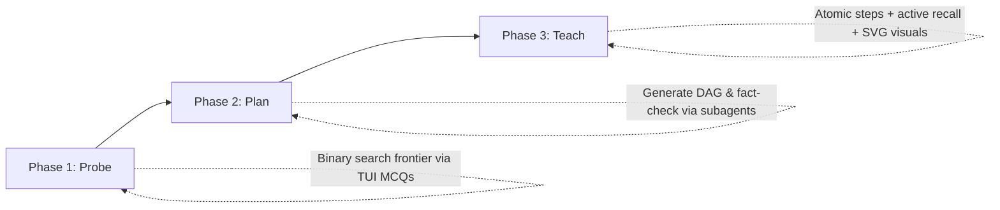

# 🎓 pi-learn

An interactive, high-retention 1-to-1 learning package for the **[Pi coding agent](https://github.com/)**, inspired by the pedagogical architecture shared by **Eero Alvar** (*"How I Use AI to Learn Things"*).

`pi-learn` transforms Pi into an adaptive personal tutor that calibrates to your exact knowledge boundary, plans a Directed Acyclic Graph (DAG) of atomic reasoning steps, walks the path one step at a time, verifies concepts visually, and syncs everything live into **Obsidian** with full LaTeX equations and Mermaid diagrams.

---

## ⚡ 1-Click Install

### Install directly via Pi CLI:
```bash
# Install package from GitHub
pi install git:github.com/Josephxcx/pi-learn

# Or from local clone
pi install /path/to/pi-learn
```

### Try without installing:
```bash
pi -e git:github.com/Josephxcx/pi-learn
```

---

## 🧠 The Pedagogical Philosophy

Traditional learning is **many-to-many** (one course teaches many; one learner juggles many sources), introducing two critical inefficiencies:
1. **Uncalibrated Pace:** Content either covers what you already know or leaps past prerequisites.
2. **Cognitive Overhead:** Mental energy is wasted on logistics, sequencing, and switching styles rather than wrestling with the subject matter.

`pi-learn` implements a **1-to-1 aggregate interface** operating strictly on the learner's frontier.



---

## 🚀 The 3-Phase Architecture

### Phase 1: Probe (Knowledge Calibration)
* Prompts you with interactive, selectable **Multiple-Choice Questions (MCQs)** directly in the terminal TUI.
* Binary-searches the boundary of your prerequisite understanding across all concept strands needed for the topic.

### Phase 2: Plan (DAG Roadmap & Verification)
* Generates a Directed Acyclic Graph (DAG) of minimal, atomic reasoning steps bridging your current edge to your target mastery.
* Renders a live **Mermaid flowchart** and links the session to your Obsidian vault.

### Phase 3: Teach (Single-Step Traversal & Active Recall)
* **One Reasoning Step at a Time:** Prevents standard LLM walls of text. Explanations provide intuitive physical analogies alongside formal LaTeX mathematics ($$\dots$$).
* **Self-Verifying SVG Visuals:** Generates vector diagrams, renders PNG previews via `rsvg-convert`, inspects them for visual flaws, and embeds verified graphics into notes.
* **Active Recall Gate:** Every step is followed by an interactive MCQ. The tutor only advances along the DAG once comprehension is proven.

---

## 🛠️ Features & Extensions Included

| Extension / Tool | Description |
| :--- | :--- |
| **`ask_mcq`** | Interactive terminal TUI selector tool with arrow-key navigation, custom answers, and *"🤷 I don't know"* handling. |
| **`md-log`** | Live Obsidian synchronization. Auto-detects active vaults, structures notes into hierarchical subject folders, and maintains a Master Dashboard. |
| **`save_diagram_svg`** | Creates standalone SVG diagrams and auto-generates 1200px raster previews for AI visual verification. |
| **`teach` Skill** | Full pedagogical skill orchestrating the Probe $\to$ Plan $\to$ Teach flow. |

---

## ⌨️ Commands

* `/md-log [topic]` — Link or create a session note in the active subject folder.
* `/md-view` — Open the active lesson note or Dashboard directly in Obsidian.
* `/reload` — Hot-reload extensions when updating packages.

---

## 📋 System Requirements

* **Pi Agent Harness** (`pi`)
* **Obsidian** (optional, recommended for live LaTeX/Mermaid/SVG rendering)
* **`librsvg`** (`rsvg-convert`) for diagram PNG rasterization:
  ```bash
  # Arch Linux
  sudo pacman -S librsvg

  # Ubuntu / Debian
  sudo apt install librsvg2-bin

  # macOS
  brew install librsvg
  ```

---

## 📖 Quickstart Example

Simply start Pi and say:

```text
"Teach me Differential Forms"
"Teach me Soil Science: Soil Fertility and Plant Nutrients"
"Help me understand the Raft Consensus Algorithm"
"Teach me Quantum Computing basics"
```

Pi will initiate Phase 1 diagnostic probing, render your Mermaid roadmap into Obsidian, and teach the topic node by node!

---

## 📄 License
MIT License. Created for the Pi Agent Ecosystem.
