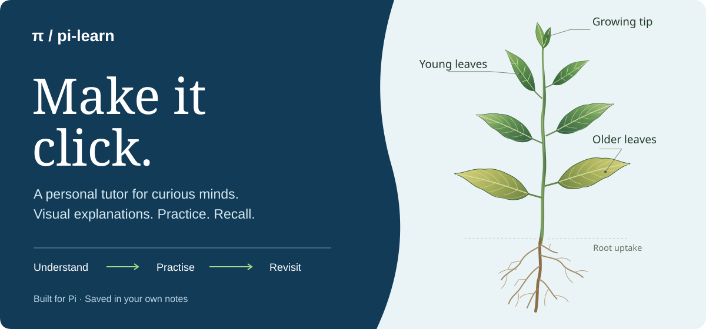
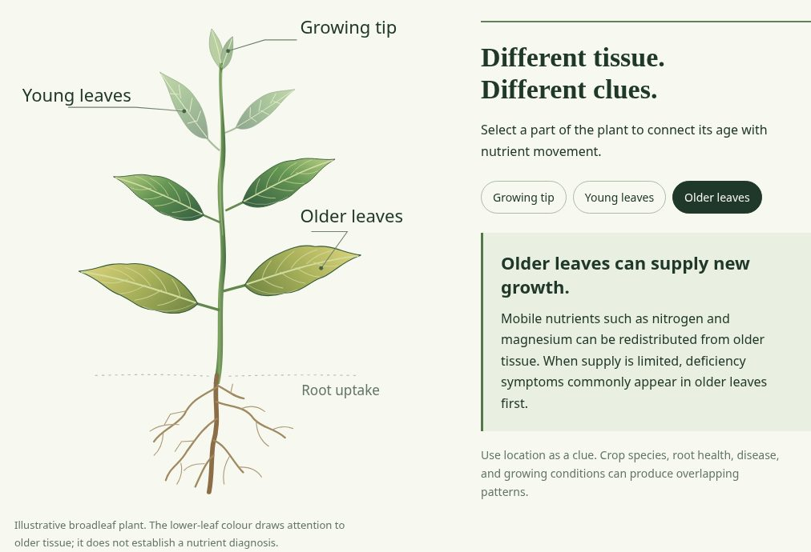
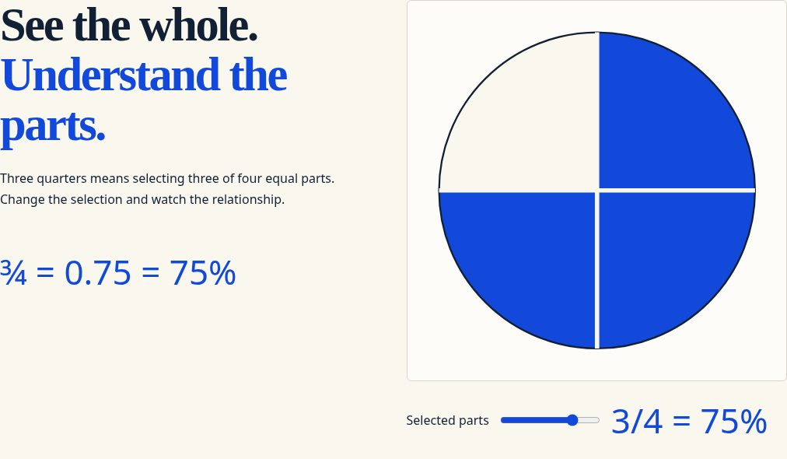

<p align="center">
  
</p>

<p align="center">
  <a href="#start-learning">Start learning</a> ·
  <a href="#see-the-idea">See the visuals</a> ·
  <a href="docs/technical-guide.md">Setup &amp; help</a> ·
  <a href="docs/teaching-design.md">How it teaches</a>
</p>

**Learn one idea at a time. See how it works. Remember it later.**

Pi-learn turns [Pi](https://github.com/badlogic/pi-mono) into a personal tutor. It explains concepts with illustrations and worked examples, asks you to try a question, and saves useful revision notes in Markdown. Open your notes in Obsidian, or use your preferred Markdown viewer.

## Start learning

Install from your terminal:

```sh
pi install git:github.com/Josephxcx/pi-learn
```

Then open Pi, run `/reload` if it is already running, and choose a topic:

```text
/pi-teach Why do some nutrient deficiencies appear in older leaves first?
```

Requires **Node.js 22.19+** and a supported Pi version (**1.1.x recommended**). See [installation and compatibility](docs/technical-guide.md#start-learning) for local installation and older Pi versions.

## See the idea

An explanation should look like the subject it teaches. Pi-learn uses the bundled **frontend-design skill** to guide composition, illustration, typography and contrast. HTML companions can include diagrams, step reveals and practice questions; simpler maps still use Mermaid.

### Follow the structure

A botanical explanation connects the growing tip, leaf age and nutrient mobility. Select a tissue in the companion to explore its role.

[](examples/visuals/plant-deficiencies.html)

[Botanical companion source](examples/visuals/plant-deficiencies.html) · [Editable plant illustration](examples/source/plant-nutrient-mobility.svg)

### Change something. Understand what changes.

Move the slider to connect selected quarters with a fraction and percentage. Try a question, then reveal the reasoning.

[](examples/visuals/fractions.html)

[Fractions companion source](examples/visuals/fractions.html) · [Nitrogen transformations companion source](examples/visuals/nitrogen-cycle.html)

**These are screenshots of included examples.** GitHub displays HTML source; download or clone the repo and open the HTML files in a browser to interact. For visuals alongside your notes, use Obsidian's HTML Viewer plugin with scripts enabled for trusted companions. [Visual setup and verification](docs/technical-guide.md#html-visual-companions)

## A lesson that stays with you

| In your lesson | What you keep |
| --- | --- |
| **Understand** — a focused explanation, illustration or worked example | Clear Markdown notes and linked visual companions |
| **Practise** — one neutral question, followed by feedback on your response | Actual attempts and corrections |
| **Revisit** — return later and try a fresh recall question | A review history and a simple due-review schedule |

You control the pace. Ask for a simpler explanation, another example, a memory aid, or to move on. HTML quizzes are local practice; their results do not update Pi's review history. The tutor records responses you give it in the conversation.

```text
“Explain that with an everyday example.”
“Show me what changes and what stays the same.”
“Ask me one question and wait for my answer.”
“Make a short revision summary of this concept.”
```

## Bring your exam. Keep the context.

Share your exact exam and post, official syllabus, and any previous-year questions you have. Pi-learn helps organise them and choose a useful next topic, with the depth guided by your syllabus and available paper evidence.

> I am preparing for [exam and post]. Here are my syllabus and past papers. Help me choose what to study first, then teach me one topic at a time.

Start without past papers if necessary. Pi-learn does not include a complete question bank or predict the next exam. General Studies, English and technical papers need different approaches; a job title or Group A–D classification alone does not determine difficulty. [Exam context and evidence](docs/exam-context.md)

## Your notes, in your folder

Notes are ordinary Markdown. Illustrations and self-contained HTML companions live beside them; saved progress keeps track of actual practice and due reviews. Add personal annotations in **Your notes**, and keep the lesson folder together when moving or backing it up.

Pi-learn can discover a single registered Obsidian vault. With none registered, it defaults to `Documents/pi-learn` in your home folder. [Choose a different notes folder](docs/technical-guide.md#notes-and-obsidian)

| Command in Pi | Use it to |
| --- | --- |
| `/pi-teach your topic` | Start or resume a lesson |
| `/md-view` | Request opening the active note in Obsidian |
| `/learn-status` | See saved progress and due reviews |
| `/learn-review` | Practise concepts due in the active note |

Reviews run when you request them; there are no background reminders. Immediate success is practice evidence, not a claim of lasting mastery.

## Explore further

- [Complete lesson: Fundamental Rights and Directive Principles](examples/lessons/fundamental-rights-and-directive-principles.md)
- [Setup, recovery and developer guide](docs/technical-guide.md)
- [Teaching approach](docs/teaching-design.md)
- [Bundled frontend-design skill and license](skills/frontend-design/)
- [MIT license](LICENSE)
