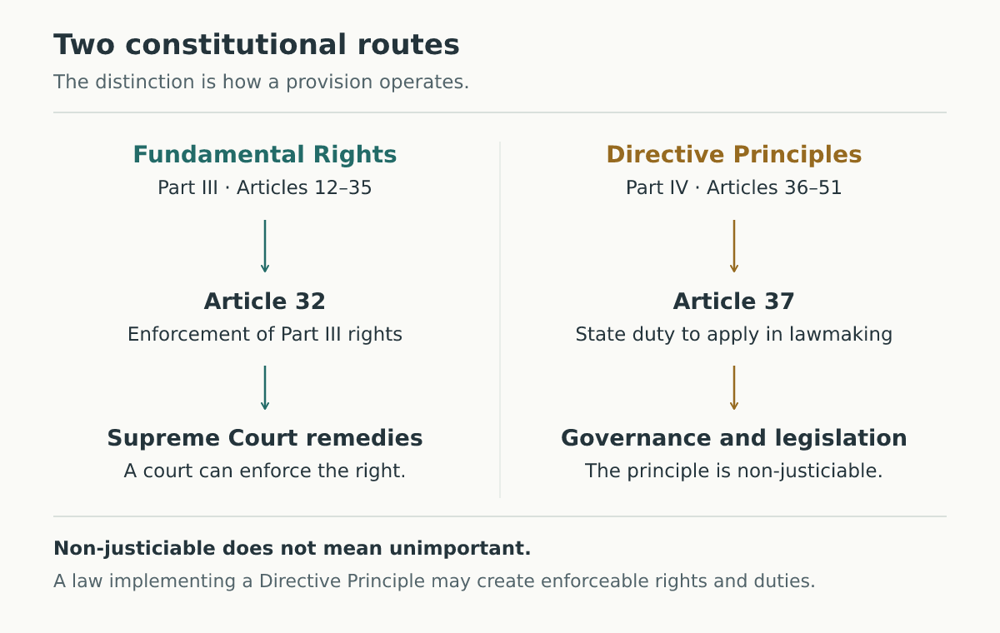

# pi-learn: setup and technical guide

For everyday use, start with the [simple guide](../README.md). This page contains installation, configuration, recovery and developer details.

A personal tutor for [Pi](https://github.com/badlogic/pi-mono) that saves useful learning notes in Markdown and Obsidian. Learn one manageable step at a time, practise recall, and prepare at the standard of your selected exam.

pi-learn supports general learning and syllabus-based preparation for Mizoram or central recruitment. Your exact post, paper, syllabus version and past questions determine the scope. Group classification and gazetted status are recorded separately; they are not automatic difficulty settings.

## Start learning

Requires **Node.js 22.19 or newer**. **Pi 1.1.x** is recommended; the checks also cover legacy **Pi 0.85.1–0.85.x** compatibility. Other Pi release lines are not covered by the current checks. Keep the Pi host itself updated: extension installation does not patch an older host's dependencies.

From this checkout:

```sh
npm ci
pi install /absolute/path/to/pi-learn
```

Reload Pi with `/reload`, or restart it. Then use:

```text
/pi-teach Fundamental Rights and Directive Principles
```

The canonical skill command is `/skill:pi-learn`. `/pi-teach` forwards to that skill with the topic you provide. No separate `pi-teach` package is required. An interactive question extension is optional: without one, the tutor asks questions in ordinary chat and waits for your response. Installation does not install global Pi packages or change your Obsidian preferences.

For exam preparation, tell the tutor your post/exam and provide the relevant syllabus and papers. You can ask it to prepare the supported local source files; you do not need to write JSON yourself. The extension does not automatically scrape, OCR or download a complete PYQ library.

## Notes and Obsidian

Set `PI_LEARN_VAULT` to the **absolute path of your chosen vault** before starting Pi. For example, in a Unix shell:

```sh
export PI_LEARN_VAULT="$HOME/Documents/Study"
pi
```

In PowerShell:

```powershell
$env:PI_LEARN_VAULT = "$HOME\Documents\Study"
pi
```

Without this setting, pi-learn reads Obsidian's registered vault locations on Windows, macOS or Linux. A single existing vault can be selected automatically; multiple vaults require an explicit choice. If none is registered, it uses `~/Documents/pi-learn`, which you can open as an Obsidian vault. It never changes `.obsidian/app.json`.

A typical lesson produces:

```text
General/
  fundamental-rights.md
  fundamental-rights.md.pi-learn.json
  fundamental-rights.assets/
    enforcement.svg
    .previews/<content-hash>.png
```

The Markdown note contains a personal-notes area, revision material, an optional roadmap, lesson steps, retrieval history and mistakes to revisit. The adjacent JSON contains structured progress; keep it with the note when backing up or moving your learning files. Assets belong to that specific note, so two lessons can use the same diagram filename safely.

Starting the same topic resumes its existing note. It does not replace your writing. Write personal annotations in **Your notes**, outside the marked generated block. If you edit generated content, the next write stops instead of discarding your edits. `/learn-repair` makes a complete sibling backup and rebuilds that block from the saved progress; move any corrections you want to keep into your personal notes. Ambiguous markers or corrupt progress require explicit repair of the affected files.

Active-note pointers are separate for each Pi session and stored under `~/.pi/agent/pi-learn/sessions`. Override that directory with `PI_LEARN_STATE_DIR`. Resuming the same Pi session restores its pointer; a new Pi session starts without one. Reopen a lesson by asking the tutor to initialize its topic/exam or exact `customPath`.

## Commands

| Command | Action |
| --- | --- |
| `/pi-teach [topic]` | Start or resume tutoring through the skill |
| `/md-log <topic>` | Create or resume a general learning note |
| `/md-log` | Show the active note |
| `/md-view` | Request that Obsidian open the active note |
| `/learn-status` | Show saved concept and due-review counts |
| `/learn-review` | Start recall practice for due concepts in the active note |
| `/learn-recover` | Explicitly link the note from the old global session file |
| `/learn-repair` | Back up an edited note and restore its generated block |

`/md-view` requires Obsidian and an operating-system URI launcher. A headless machine can still create and read all notes; launcher failures include the file path to open manually.

## Retrieval practice

A taught concept is initially due after one day. Correct immediate practice is also due after one day; it does not establish retention. Correct delayed attempts schedule reviews after 3, 7, 14 and then 30 days. A mistake resets that sequence and schedules one day. Delayed recall requires at least 24 hours since teaching or the last attempt.

This is a transparent scheduling heuristic. The stored states are `taught`, `immediate-recall`, `delayed-recall` and `needs-review`, not a certification of mastery. Attempts and corrections remain in history. Reviews are on demand and currently scoped to the active note; no background reminders are sent.

## Exam syllabuses and PYQs

The preferred layout is:

```text
<your-vault>/
  <exam-id>/
    exam.json
    pyqs.json
```

`exam.json` describes the exam, papers, units, subtopics and explicit prerequisites. Optional profile fields record the notified post, authority, group, gazetted status, route, syllabus version and difficulty guidance. `pyqs.json` contains a paper manifest and questions with source identities and topic mappings. Missing years, marks and mappings remain unknown. Set `complete: true` only when the whole paper was imported.

See the working **fictional** [exam](../examples/exams/synthetic-assistant/exam.json) and [PYQ dataset](../examples/exams/synthetic-assistant/pyqs.json) for the format. Their invented questions and weights demonstrate imports, not any real examination. The JSON profile uses `gazettedStatus: "gazetted" | "non-gazetted" | "unknown"`; the teaching session's profile uses `gazetted: true | false | "unknown"`.

The tutor can call `prioritize_syllabus` or `drill_down_syllabus` with an exact `examId`, or explicit `taxonomyPath` and `pyqPath`. Relative source paths start at the selected vault. A taxonomy supplied from another directory should be accompanied by an explicit `pyqPath`. When multiple exams are present, no unrelated exam is silently selected. Use `unitId` to distinguish units with the same number in different papers.

Legacy MUDAL and SAS-I Markdown syllabus layouts are still supported. Legacy Markdown PYQs require an explicit MUDAL directory through `pyqPath`; there is no hardcoded path in your home directory. Legacy keyword mappings are provisional and should be reviewed before relying on them.

Recommendations report evidence limitations. They distinguish actual paper coverage from year counts, exclude unassigned questions from topic totals, and deduplicate source-question copies within a sitting. Canonical paper and source-question IDs must identify booklet variants consistently. A repeat from another sitting remains separate evidence. Inconsistent mappings, conflicting duplicates and cyclic prerequisites are rejected.

Scores are **uncalibrated study-order heuristics**, not probabilities, predicted marks, or marks per hour. Their components are declared weight, known dated PYQ marks, observed paper coverage, prerequisite value and optional user-estimated effort. Missing evidence can lower a score without making a topic unimportant. The extension does not infer a rising trend from repetition or call a topic “new syllabus” because no PYQs were supplied. See [exam context](exam-context.md) for interpreting administrative classifications and different paper standards.

## Teaching and visuals

The [teaching contract](../skills/pi-learn/SKILL.md) guides the tutor to use understandable explanations, neutral retrieval questions, concise revision summaries and source references. It allows a useful general lesson when exam evidence is missing. AI output still needs factual judgment; the extension cannot guarantee every explanation or answer key.

Visuals follow the bundled frontend-design skill, adapted for teaching: topic-specific composition, meaningful connections, legible labels and native Markdown comparison tables. Mnemonics are optional, with an explicit mapping and limitation. The complete [sample lesson](../examples/lessons/fundamental-rights-and-directive-principles.md) includes a diagram, comparison tables, memory cue, practice and collapsed answer callouts.



SVGs are parsed as static vector content, with scripts, external resources and unsafe paths rejected. A bundled renderer produces PNG previews without shell commands. Rendering and visual inspection are separate: the tool reports `visuallyVerified: false`, and the tutor should inspect the preview before embedding it. Existing different SVG content is preserved; use a new filename for a revision.

## Migration and recovery

- Existing Markdown notes remain readable. Use `customPath` to adopt a particular old note without replacing its contents.
- `/learn-recover` reads `~/.pi/agent/learn-session.json` only when explicitly invoked. It preserves old note content and legacy embeds; new assets are note-local. It does not reconstruct mastery from old prose.
- Keep the note, progress JSON and assets together. Note moves are not automatically detected; reinitialize with the moved path after moving all three.
- Writes use cooperative locks and a transaction journal. Replacements first move the existing file into a hidden `.pi-learn-backups` directory, then publish the completed new file without overwriting another editor's save. A replacement recovery record restores a missing pathname after a killed writer. The pathname is briefly absent during publication; extension readers wait for the writer. Recovery copies are retained, including on success, so they consume disk space; archive or remove old copies only after checking your notes and closing Pi.
- After interruption, a valid note/progress journal is recovered on the next operation. A conflicting external edit stops recovery for inspection. Retain `.pi-learn-replacement.json` records until recovery completes; they identify displaced files.
- After a process crash, a leftover `.lock` may need removal. Inspect the lock's PID and close any process using the note before removing it. Do not delete a transaction journal as a routine fix.
- Use a writable local filesystem supporting hard links and atomic rename, such as APFS, NTFS or ext4. FAT/exFAT are unsupported. Local concurrent-editor conflicts preserve recovery copies, but cloud sync across devices is not a distributed transaction; keep backups. Destination and user-created ancestor symlinks are rejected; use the real path.

## Tools for the tutor

Existing tool names remain: `init_learning_session`, `update_learning_plan`, `append_lesson_node`, `save_diagram_svg`, `prioritize_syllabus`, and `drill_down_syllabus`. New tools are `get_learning_status`, `get_due_reviews`, and `record_review_attempt`. All return Pi-compatible content and details, and failures propagate as tool errors. Mutating calls are sequential in Pi; filesystem locks also protect notes shared by multiple Pi processes.

Use stable `nodeId` and `attemptId` values when retrying. An `activeRecallQuiz` supplied to `append_lesson_node` already records an immediate attempt; do not record it again with the review tool. No note is implicitly created by a plan, append or diagram call.

## Development

```sh
npm ci
npx playwright install --with-deps chromium
npm run check
npm run check:package
```

`check` runs strict TypeScript and Node's test runner. Tests use temporary vaults and include the real Pi extension loader, session isolation, storage recovery, rendering safety, syllabus parsers and evidence scoring. CI is configured for Node 22 and 24 on Linux, macOS and Windows, against current and legacy Pi bindings; a local Linux pass does not establish that remote matrix has run.

The architecture separates `extensions/bindings` (typed Pi tools), `extensions/learning` (local files, progress and diagrams), and `extensions/prioritization` (source validation, parsing, scoring and presentation). `extensions/md-log.ts` registers commands and connects those services. No hosted backend, remote account or database server is needed.


## HTML visual companions

The bundled `frontend-design` skill and `get_visual_design_guidance` tool provide design guidance for all lesson visuals. `get_visual_components` supplies the HTML component contracts. `save_visual_html` saves self-contained pages in the active note's assets folder, using the same session isolation, file locking and protected writes as the learning store. `append_lesson_node` accepts `visualFilename` and `visualTitle`; these survive later reviews and managed-note repairs.

Pages include shared styles and controls for step reveals, sliders and single/multiple-answer practice. Optional `includeMath` embeds KaTeX and its fonts. There are no required CDN resources or paid image APIs. HTML practice is separate from Pi's retrieval history; record only responses actually received through the tutor.

Open the page in a browser, or install Obsidian's HTML Viewer community plugin and enable scripts for trusted companions. Actual HTML Viewer compatibility still needs a manual check in Obsidian; browser tests do not reproduce its sandbox.

Browser verification uses optional Playwright/Chromium. Install the browser with `npx playwright install chromium`, or set `PI_LEARN_BROWSER_PATH` to an existing Chromium executable. Saving still works if the browser is unavailable, returning `verification.status: unavailable`; `verify: false` explicitly skips checks. Neither state means verified. Checks run offline at 1200px and 400px, inspect script errors, external dependencies and overflow, exercise standard controls, and return temporary screenshots. Inspect those screenshots and check factual accuracy separately. Custom interactions need their own tests.

Developer examples: `npm run visual:examples` rebuilds the three standalone examples; `npm run visual:verify` also checks them in Chromium. The package includes runtime styles and scripts under `assets/visual-companion`, and the upstream frontend-design skill with its Apache-2.0 license and provenance under `skills/frontend-design`.


### Repository visuals

The README uses an SVG cover and compressed screenshots of the included companions. To regenerate them after changing the examples, run `node scripts/build-repo-visuals.mts` from a repository checkout with Playwright and Chromium installed. The editable cover composition lives in that script; the plant illustration comes from `examples/source/plant-nutrient-mobility.svg`. Inspect generated images before committing. The small `docs/images` assets are packaged so README images also work in local installations.
