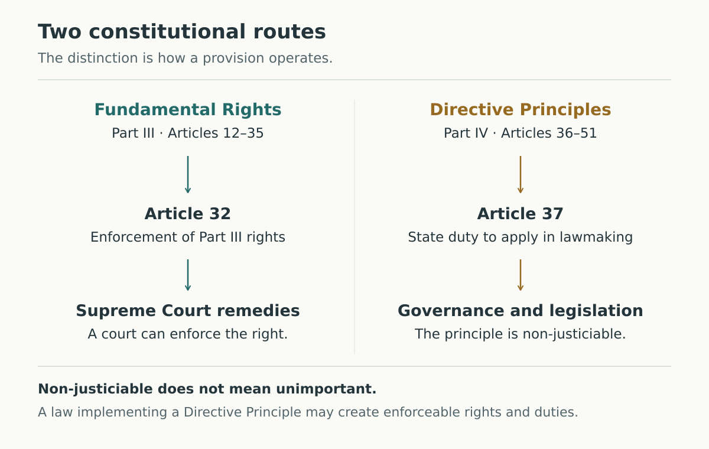

# Fundamental Rights and Directive Principles

**Learning goal:** distinguish a court-enforceable Fundamental Right from a Directive Principle, then apply the distinction to education provisions.

**Exam context:** this is a foundation lesson for Indian Polity. The official MPSC Inspector (Excise & Narcotics), November 2019, General Studies Paper II tests the Part containing Directive Principles (Q14), the Fundamental Rights article range (Q33), and their justiciability difference (Q34). That is evidence from one historical paper, not a frequency estimate or a promise about the learner's current exam. Match depth to the applicable syllabus before extending this lesson. [2–4]

This example shows a completed note accumulated across several teaching turns. In chat, teach one step, ask one question, and wait. The answers below are collapsed in compatible Obsidian reading views; raw Markdown exposes them.

## Revision page

### The distinction to remember

Fundamental Rights are in **Part III, Articles 12–35**. They are justiciable: constitutional remedies are available to enforce these rights. Article 32 guarantees the right to move the Supreme Court for enforcement of rights conferred by Part III. [1]

Directive Principles of State Policy (DPSPs) are in **Part IV, Articles 36–51**. Article 37 says these provisions are not enforceable by any court, but are fundamental in the governance of the country. It is the duty of the State to apply them in making laws. **Non-justiciable does not mean optional or unimportant.** [1]

| Recall dimension | Fundamental Rights | Directive Principles |
| --- | --- | --- |
| Constitutional location | Part III; Articles 12–35 | Part IV; Articles 36–51 |
| Key distinction | Justiciable rights | Principles not enforceable by a court as such |
| Anchor for this lesson | Article 32: remedy for enforcement of Part III rights | Article 37: non-enforceability and the State's lawmaking duty |
| Education example | Article 21A: free and compulsory education for children aged 6–14, in the manner the State determines by law | Article 45: State endeavour to provide early childhood care and education until children complete age 6 |
| Exam trap | “Every right is absolute” does not follow from justiciability | “Not court-enforceable, therefore constitutionally insignificant” is wrong |

**Boundary:** legislation implementing a Directive Principle can create enforceable legal rights and duties. The principle's non-justiciability does not make the implementing law unenforceable. This lesson does not resolve every conflict between Parts III and IV; avoid an absolute “one always wins” rule. [1]

### A visual route through the distinction

*Read from top to bottom in each lane. The figure compares routes, not ranks. Article 37 directs lawmaking even though a Directive Principle itself is not court-enforceable. A resulting law may be enforceable. This schematic is not an exhaustive account of remedies or constitutional interpretation.*

In Obsidian, the same figure can be embedded as `![[assets/rights-and-directives.svg]]` when the note and its assets folder are kept together.

### Optional memory cue

**“Rights → remedy; Principles → policy.”**

| Cue | Exact mapping |
| --- | --- |
| Rights → remedy | Part III rights have constitutional enforcement; Article 32 is the anchor here |
| Principles → policy | Part IV directs governance and lawmaking; Article 37 is the anchor here |

**Limit:** this is a contrast in enforcement, not a complete definition. Fundamental Rights can impose positive obligations, including Article 21A. DPSPs are more than policy suggestions, and legislation implementing them may be enforceable. Skip the cue if the table is easier to remember.

### Closed-note recall prompts

- Which Parts and article ranges contain Fundamental Rights and DPSPs?
- What two claims does Article 37 make that must be remembered together?
- How do Article 21A and Article 45 divide the education-related age groups?
- Why is “a DPSP is not justiciable” different from “a law implementing it cannot be enforced”?

## Lesson history

### Step 1 — Separate importance from enforceability

**Starting question:** can a constitutional principle matter even when a court cannot enforce that principle itself?

Yes. “Important for government” and “directly enforceable by a court” answer different questions. A Fundamental Right gives a constitutional entitlement with remedies for enforcement. A Directive Principle instructs the State in governance and lawmaking, but Article 37 makes the principle itself non-justiciable. [1]

Article 37 contains both halves of the rule. Its non-enforceability clause must be read together with the statement that the principles are fundamental in governance and must be applied by the State in making laws. Calling them “mere wishes” loses the second half.

**Worked reasoning:** suppose a statement says, “Because DPSPs are non-justiciable, the Constitution assigns them no role in lawmaking.” The first clause is correct. The conclusion is incorrect: Article 37 expressly assigns the State a duty to apply them in making laws.

#### Practice 1 — One distinction

Which statement correctly describes Article 37?

A. DPSPs are court-enforceable and guide the State when it makes laws.\
B. DPSPs are not court-enforceable and have no role in making laws.\
C. DPSPs are not court-enforceable and guide the State when it makes laws.\
D. DPSPs are court-enforceable and have no role in making laws.

Pause and explain the choice before opening the answer.

> [!question]- Answer and reasoning — open after attempting
> **C.** Article 37 combines non-enforceability with constitutional importance and a duty of the State in lawmaking. B retains the first half but removes the second. A and D incorrectly make DPSPs court-enforceable as such. “Guide” here includes the constitutional duty to apply the principles; it does not mean they are optional suggestions.

**Revision takeaway:** non-justiciable describes enforcement; it does not erase the State's constitutional duty.

### Step 2 — Attach the distinction to exact provisions

Now anchor the concept to its location. Part III contains Fundamental Rights; Part IV contains DPSPs. Article 32 concerns enforcement of Part III rights. Article 37 explains the position of the Directive Principles. [1]

Do not confuse Part IV with **Part IVA**, which contains Fundamental Duties under Article 51A. The duty of the State described in Article 37 is not a member of the Article 51A list of citizens' Fundamental Duties.

| Anchor | Recall it as |
| --- | --- |
| Part III, Articles 12–35 | Fundamental Rights |
| Article 32 | Supreme Court remedy for enforcement of Part III rights |
| Part IV, Articles 36–51 | Directive Principles of State Policy |
| Article 37 | Non-enforceable by courts; fundamental in governance; State duty in lawmaking |
| Part IVA, Article 51A | Fundamental Duties; a separate constitutional category |

The article ranges describe the span of the Parts. They do not imply that every number is an unchanged, currently operative provision; the constitutional text includes insertions and omissions. Learn the range without inventing a count of rights from arithmetic.

#### Practice 2 — Spot the category

A question asks for the constitutional provision guaranteeing recourse to the Supreme Court for enforcement of Part III rights. Which is the correct anchor?

A. Article 32\
B. Article 37\
C. Article 45\
D. Article 51A

> [!question]- Answer and reasoning — open after attempting
> **A.** Article 32 concerns remedies for enforcing Part III rights. Article 37 explains DPSPs; Article 45 concerns early childhood care and education; Article 51A lists Fundamental Duties. This question concerns a specific constitutional route, not every power of every court.

**Revision takeaway:** attach each article number to a precise function, not just a vague topic word.

### Step 3 — Apply the distinction to education

The word “education” can appear in more than one constitutional category. Classify the exact provision, not its broad topic. [1]

| Provision | Constitutional category | Precise age/scope cue |
| --- | --- | --- |
| Article 21A | Fundamental Right, Part III | Free and compulsory education for children aged 6–14, in the manner determined by law |
| Article 45 | Directive Principle, Part IV | Early childhood care and education until children complete age 6 |
| Article 46 | Directive Principle, Part IV | Educational and economic interests of weaker sections, particularly Scheduled Castes and Scheduled Tribes; protection from social injustice and exploitation |

**Worked reasoning:** “Early childhood care and education until the age of six” points to Article 45. It does not become an Article 21A claim merely because both provisions concern education. Article 46 has a different scope and should not be reduced to an age band.

**Version trap:** older materials may reproduce the earlier wording of Article 45 about education up to age fourteen. Use the applicable consolidated constitutional text. For this lesson, the verified 2024 edition places the 6–14 right in Article 21A and the under-six endeavour in Article 45. [1]

#### Practice 3 — Apply two conditions

Consider the statements:

1. Article 21A concerns free and compulsory education for children aged 6–14.
2. Article 45 is a Fundamental Right concerning early childhood care and education until children complete age 6.

Which option is correct?

A. Both statements are correct.\
B. Neither statement is correct.\
C. Only statement 2 is correct.\
D. Only statement 1 is correct.

> [!question]- Answer and reasoning — open after attempting
> **D.** Statement 1 correctly identifies Article 21A. Statement 2 gives Article 45's subject but assigns it to the wrong category: it is a Directive Principle in Part IV. A statement can contain a correct age cue and still be false because its constitutional category is wrong.

**Revision takeaway:** check both the content and the constitutional category of a statement.

## Later retrieval

At a later session, begin closed-note. Explain the following in two sentences: “A Directive Principle cannot itself be enforced by a court, but a law implementing it may be enforceable.” Then give the Article 21A/45 age distinction without opening the table.

After the response, consult the key:

> [!question]- Delayed-review key — open after attempting
> Article 37 makes DPSPs non-justiciable as such while requiring the State to apply them in lawmaking. An implementing law can establish enforceable legal rights and duties. Article 21A addresses free and compulsory education for children aged 6–14; Article 45 addresses early childhood care and education until children complete age 6.

The tutor records a real response once, with its timestamp and a specific takeaway. It uses delayed recall only after at least 24 hours since teaching or the most recent attempt. Consult the saved queue for the next review. A correct immediate practice answer does not establish retention.

## Attempt and misconception history

No learner attempts are recorded in this example. The questions and keys above are instructional material, not evidence of a learner's performance. In a live session, attempt history is stored separately from the revision page and preserves mistaken answers after later improvement.

The tutor should watch for these misconceptions without attributing them to the learner in advance:

| Possible misconception | Corrective cue |
| --- | --- |
| Non-justiciable means constitutionally unimportant | Recall both halves of Article 37 |
| Everything about education is a Fundamental Right | Identify the exact article, category, and scope |
| Article 37 is one of the Fundamental Duties | Separate the State's lawmaking duty from Part IVA, Article 51A |
| One successful MCQ proves the topic is mastered | Ask for fresh application and later independent recall |

## Sources and scope

1. **Constitution of India, Legislative Department.** [Official entry point](https://legislative.gov.in/constitution-of-india/); [official 2024 English–Malayalam edition](https://www.legislative.gov.in/static/uploads/2025/08/7af1daa22d65f9d04c00ae9b9aa5a799.pdf). Relevant anchors: Part III, Part IV, Articles 21A, 32, 37, 45, 46, and Part IVA/Article 51A. In that edition, printed English pages 11, 17, 20–22 cover Articles 21A, 32, 37, 45 and 46. The PDF was inspected for the lesson's principal provisions; do not assume it is the latest edition for every future exam.
2. **MPSC syllabus entry points.** [Syllabus](https://mpsc.mizoram.gov.in/page/syllabus) and [non-gazetted syllabus](https://mpsc.mizoram.gov.in/page/syllabus-ng). These locate official documents; this sample does not claim a current post-specific syllabus mapping. Direct page retrieval was blocked during source checking, so no claim here depends on having inspected their current contents.
3. **MPSC historical exam evidence.** [Inspector under Excise & Narcotics, November 2019, General Studies Paper II](https://mpsc.mizoram.gov.in/uploads/attachments/26ccd6a648eaf41845eb807d4b34d344/general-studies-paper-ii-inspector-of-excise.pdf). Q14 concerns the DPSP Part; Q33–34 concern the Fundamental Rights span and the justiciability distinction (printed p. 4). The paper was inspected; an official answer key was not checked. The original practice items in this lesson are not transcribed PYQs.
4. **Current exam selection.** Choose the learner's exact notification and syllabus before assigning weightage, question frequency, or current paper depth. A single historical paper cannot establish any of those.

*Source check: 8 October 2026. This lesson covers the core constitutional distinction, not the full case law, amendment history, emergency provisions, or every exception. Add those only when the target syllabus and question standard require them.*
